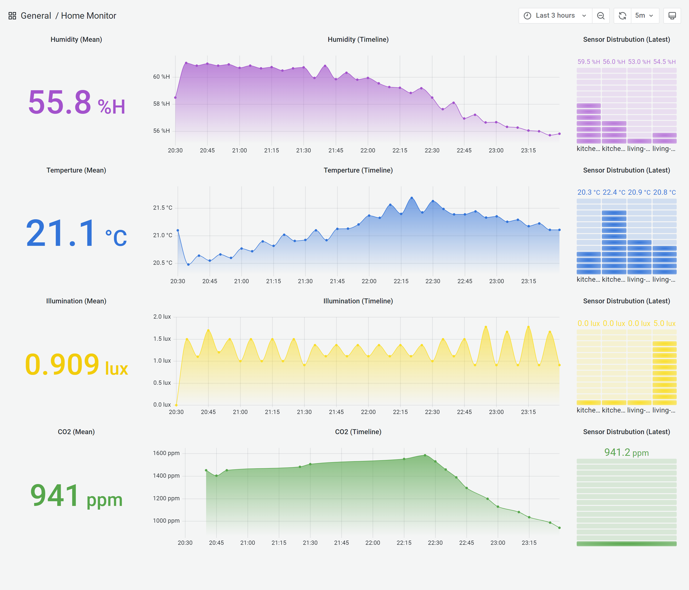
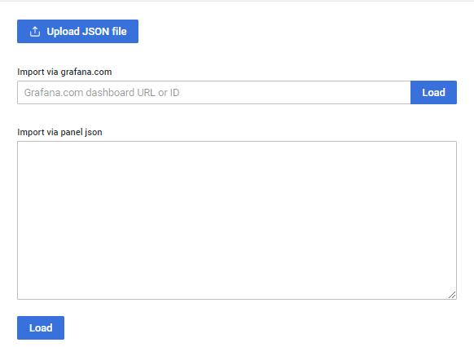

# Grafana Integration



## Add InfluxDB to Grafana

You can follow the [Official Guide](https://docs.influxdata.com/influxdb/v2.4/tools/grafana/) on the InfluxDB's documentation site in order the add your InfluxDB instance to Grafana.

## Import Dashboard

To import a dashboard click **Import** under the **Dashboards** icon in the side menu.



Paste the below link into ***Import via grafana.com***,

```
https://raw.githubusercontent.com/yusufcanb/enohub/docs/resources/example-dashboard.json
```

Finally, click the ***Load*** button to import the example dashboard.