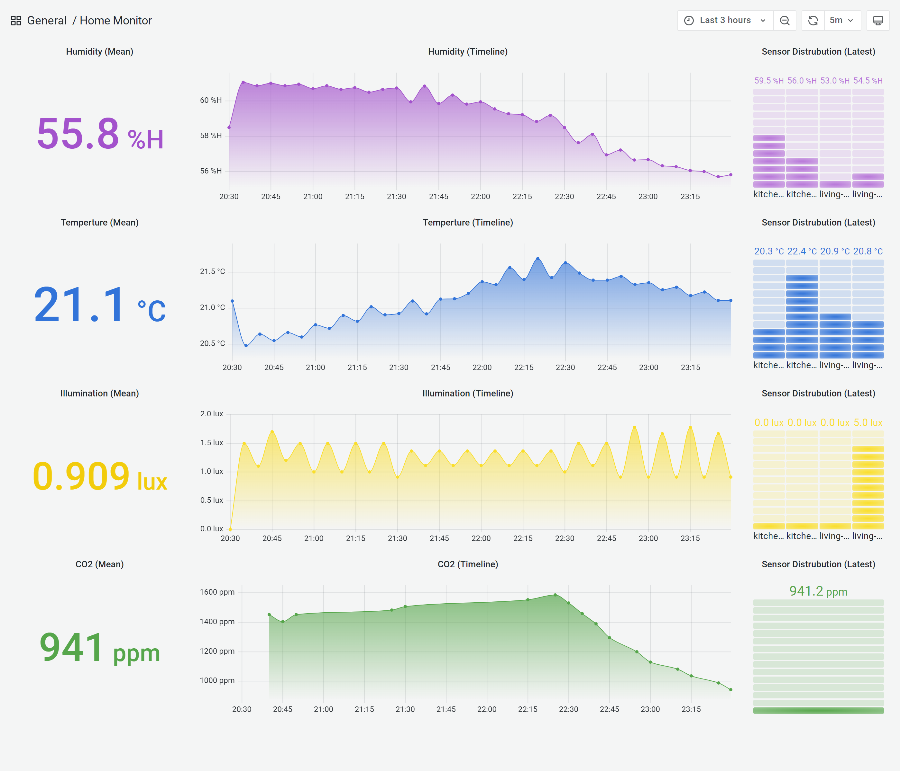

# Overview

This project aims to act as an device hub which collects sensor data and puts it into InfluxDB Time-Series database for quick visualization. 



## Hardware Requirements

- EnOcean STM 550 Multisensor
- EnOcean USB 3000 Radio Receiver
- Raspberry Pi 3+

## Software Requirements

On Raspberry Pi you need them to be installed;

- Docker
- Docker Compose

## External Requirements

- InfluxDB
- Grafana (Optional for Visualization)

## Quick Start

First, create the config file,

```shell
cat << EOF > config.yaml
name: office
port: /dev/ttyUSB0

devices:
  - id: 04211ABE
    name: desk
    eep: d2-14-41
    
  - id: 04211945
    name: table
    eep: d2-14-41
  
  - id: 051B0025
    name: co2-meter
    eep: a5-09-09

database:
  url: https://your-influxdb-host:port
  org: your-org
  token: your-access-token
  bucket: your-bucket
EOF
```

Then, execute docker command below to start EnOcean Hub

```
docker run --device=/dev/ttyUSB0 -v "$PWD/config.yaml:/opt/enocean/enohub/config.yaml" ghcr.io/yusufcanb/enohub:latest
```